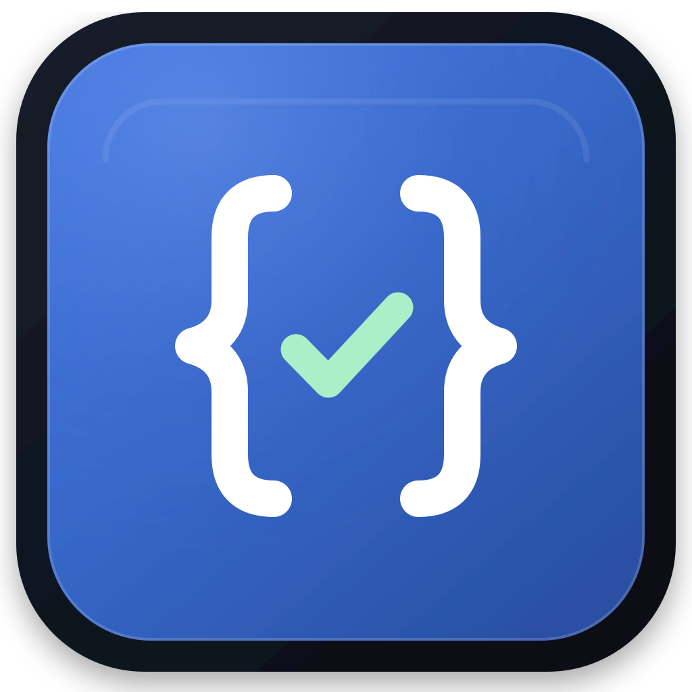

# Validex



Validex, HTTP API'lerini geliştirmek, test etmek ve incelemek için bir masaüstü
uygulamasıdır. İstek yönetimi, koleksiyonlar, OpenAPI araçları, mock sunucu ve
performans ölçümlerini tek çalışma alanında sunar. Arayüz Türkçe ve İngilizce
kullanılabilir.

Uygulama Electron, TypeScript ve Go ile geliştirilmiştir. Otomasyon işlemleri
masaüstünden bağımsız çalışan `validex-cli` üzerinden yürütülebilir.

## Özellikler

| Çalışma alanı | Özellikler |
| --- | --- |
| Requests | HTTP istekleri, cURL içe aktarma, koleksiyon yönetimi, yanıt ve bağlantı zamanlarını inceleme. |
| Mock Server | Özel rotalar veya OpenAPI tanımlarıyla yerel mock sunucu oluşturma ve gelen istekleri izleme. |
| JSON Lab | JSON biçimlendirme, karşılaştırma, JSON Path sorguları, şema ve örnek veri araçları. |
| Diagnostics | Spring hataları, JWT, Actuator, thread dump, log ve ortam karşılaştırmaları. |
| Performance | URL bazlı gecikme, throughput ve hata ölçümleri; eşzamanlı örnekleme, rapor karşılaştırma ve dışa aktarma. |

Koleksiyonlar Postman Collection v2.1 biçiminde içe ve dışa aktarılabilir.
OpenAPI tanımlarından istekler ve mock rotaları oluşturulabilir.

## Gereksinimler

- Go 1.24 veya üzeri
- Node.js 22.12 veya üzeri ve npm
- GNU Make ve `curl`

Linux'ta grafik masaüstü ortamı ve dosya seçimi için `zenity` veya `kdialog`
gerekir. Windows'ta Make komutlarını GNU Make ve `curl` kurulu Git Bash
üzerinden çalıştırın.

## Hızlı başlangıç

Aşağıdaki komutları proje kökünde çalıştırın:

```bash
make dev
```

Bu komut bağımlılıkları kurar, Go arka ucunu ve Electron kodunu derler,
geliştirme sunucusunu başlatır ve masaüstü uygulamasını açar. Arayüzdeki kaynak
değişiklikleri otomatik derlenir; sonucu görmek için pencereyi yenileyin.
Go veya Electron kodunu değiştirdiğinizde `make dev` komutunu yeniden başlatın.

## Paketleme ve kurulum

Her platformun paketini ilgili işletim sisteminde oluşturun:

| Platform | Komut | Çıktı |
| --- | --- | --- |
| Debian/Ubuntu | `make linux_app` | `build/bin/validex_<sürüm>_<mimari>.deb` |
| Windows | `make windows_app` | `build/bin/Validex/validex.exe` |
| macOS | `make macos_app` | `build/bin/Validex.app` |

Derleme çıktıları proje kökündeki `build/bin/` dizinine yazılır. Windows'ta
uygulamayı taşırken `Validex/` klasörünü bütün içeriğiyle kopyalayın.
macOS paketi varsayılan olarak ad-hoc imzayla oluşturulur.

Linux paketini hazırlamak için:

```bash
sudo apt install dpkg-dev
make linux_app
```

Oluşan `.deb` dosyasını APT ile kurun. Örneğin, `0.2.0` sürümünün `amd64`
paketi için:

```bash
sudo apt install ./build/bin/validex_0.2.0_amd64.deb
```

Dosya adını kendi derleme çıktınızla eşleştirin. Kurulum tamamlandığında
uygulamayı menüden veya `validex` komutuyla açabilirsiniz. Paket, `validex-cli`
komutunu da kurar. Sistem bağımlılıkları derleme ortamından belirlendiği için
Linux paketini hedef dağıtımla uyumlu bir ortamda oluşturun.

## Komut satırı

CLI'yi kaynak koddan derleyip kullanılabilir komutları listeleyin:

```bash
make build-cli
./build/bin/validex-cli --help
```

| Komut | İşlev |
| --- | --- |
| `inspect` | Bir URL'nin DNS, TLS ve HTTP erişimini inceleme. |
| `lint` | OpenAPI belgesini denetleme. |
| `run` | İstek koleksiyonunu çalıştırma ve doğrulama sonuçlarını raporlama. |

Örnek OpenAPI belgesini denetlemek için:

```bash
./build/bin/validex-cli lint --file openapi.sample.yaml --json
```

`run`, [örnek koleksiyonda](collection.sample.json) gösterilen Validex runner
JSON biçimini kullanır. Postman dosyaları masaüstü arayüzünden içe aktarılır.
Komut seçeneklerine `inspect --help`, `lint --help` ve `run --help` ile
ulaşabilirsiniz. Windows'ta CLI dosyasının adı `validex-cli.exe` olur.

## Geliştirme ve test

| Komut | Açıklama |
| --- | --- |
| `make deps` | npm bağımlılıklarını hazırlar. |
| `make build` | Geçerli platformun masaüstü uygulamasını ve CLI'sini derler. |
| `make test` | Frontend/Electron tür kontrollerini ve birim testlerini, ardından Go testlerini çalıştırır. |
| `make test-e2e` | Chrome/Chromium üzerinde arayüz kabul testlerini çalıştırır. |
| `make test-production` | Birim ve E2E testlerine Go yarış koşulu denetimi ile `go vet` ekler. |
| `make cache_del` | Üretilen derleme ve test çıktılarını temizler. |

E2E testleri için Chrome veya Chromium gerekir. `cache_del` kaynak dosyalarını,
bağımlılıkları ve kullanıcı verilerini korur. Test hazırlığı ve senaryolar
[test rehberinde](examples/testlerin-nasil-calistigi.md) açıklanır.

## Dokümantasyon

- [Mimari](architect.md)
- [Frontend geliştirme rehberi](cmd/validex/frontend/TYPESCRIPT_ONLY_TOOLCHAIN.md)
- [Test rehberi](examples/testlerin-nasil-calistigi.md)
- [Uygulama kimliği ve kurumsal kayıt](docs/security-registration.md)
- [Üçüncü taraf lisansları](THIRD_PARTY_NOTICES.md)
