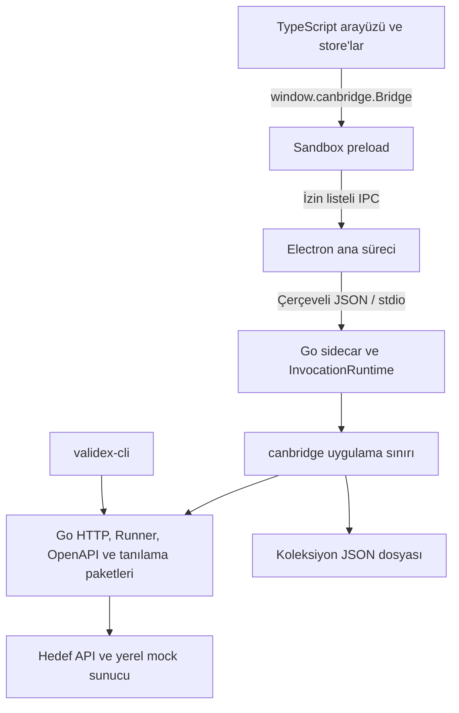

# Validex mimarisi

Validex, API isteklerini çalıştırmak ve sonuçlarını incelemek için geliştirilen
bir masaüstü uygulaması ve aynı Go paketlerini kullanan bir komut satırı aracıdır.
Masaüstü çalışma zamanı Electron kabuğu, TypeScript arayüzü ve ayrı bir Go
backend sürecinden oluşur. İşletim sistemi, dosya ve ağ işlemleri bu katmanların
sorumluluklarına göre ayrılır.

Kurulum ve kullanım için [README](README.md), arayüz derleme ayrıntıları için
[frontend araç zinciri](cmd/validex/frontend/TYPESCRIPT_ONLY_TOOLCHAIN.md) okunabilir.
Bu belge, bileşenlerin birbirine nasıl bağlandığını ve çalışma sınırlarını açıklar.

## Süreçler ve veri akışı

Electron ana süreci pencereyi, uygulama menüsünü, kaynak dosyalarının sunulmasını
ve backend çocuğunun yaşam döngüsünü yönetir. Renderer kullanıcı etkileşimini
ve ekran durumunu yönetir. Backend, arayüzden gelen doğrulanmış çağrıları Go
paketlerine aktarır; CLI bu paketleri kendi komut sınırından çağırır.

Üretimde arayüz `app://validex/` adresinden paket içindeki statik dosyalarla açılır.
Backend bağlantısı stdin/stdout üzerinden kurulur. Uygulamanın açılışı sırasında
backend için bir HTTP dinleme portu oluşturulmaz. Mock sunucu kullanıcı tarafından
başlatılır; geliştirme sunucusu ise yalnız geliştirme akışında çalışır.

## Masaüstü kabuğu ve çağrı sözleşmesi

[Electron giriş noktası](cmd/validex/electron/src/main.ts), uygulama kimliğini ve
grafik ayarlarını hazırlar; kimlik raporunu toplar, backend sürecini başlatır ve
ardından pencereyi açar. Backend yolu üretimde paketin `resources` dizininden,
geliştirmede kökteki `build/bin/` dizininden veya açık geliştirme ayarından bulunur.

Pencerede `contextIsolation` ve sandbox açıktır; Node.js entegrasyonu kapalıdır.
Navigasyon, yeni pencere, webview ve oturum izinleri sınırlandırılır. Üretim CSP'si
renderer ağ bağlantılarını kapatır; API erişimi Go tarafında yürütülür.
Geliştirme adresi yalnız HTTP(S) kullanan loopback adreslerinden kabul edilir.

Preload, `window.canbridge.Bridge` altında belirli işlevleri açar. Renderer'ın
çağrısı ana süreçte pencere, üst frame, belge kaynağı, metot adı ve argüman sayısı
bakımından denetlenir. İzin verilen metotlar
[bridge sözleşmesinde](cmd/validex/electron/src/bridge.ts) tanımlıdır.
Pano yazma işlemi ayrı IPC kanalından Electron'a gider.

[Sidecar istemcisi](cmd/validex/electron/src/sidecar.ts), backend'i kabuk komutu
kullanmadan çocuk süreç olarak açar. Her çağrıya kimlik verir ve yanıtı bekleyen
Promise ile eşleştirir. Backend çıkışı veya bozuk bir protokol yanıtı, bekleyen
çağrıların hata ile tamamlanmasına yol açar.

[Go protokolü](cmd/validex-backend/protocol.go) dört baytlık big-endian uzunluk
başlığı ve JSON yükünden oluşur. İstek `id`, `method` ve JSON dizi metni olarak
`args` taşır; yanıt aynı kimlikle `result` veya `error` döndürür. Stdout protokol
için ayrılmıştır; backend günlükleri stderr üzerinden akar.

Taşıma çerçevesi en fazla 64 MiB, tek çağrının argüman metni en fazla 32 MiB'dir.
Go tarafı JSON alanlarını ve sözleşmeyi yeniden doğrular. TypeScript tipleri tek
başına çalışma zamanı doğrulaması sayılmaz; frontend yanıt adaptörleri gerekli
dizi ve nesneleri de normalleştirir.

## Arayüzün çalışma modeli

Bu bölümdeki kaynak yolları `cmd/validex/frontend/src/` dizinine göredir.
Arayüz `main.ts` üzerinden `native/app.ts` içindeki `mountApp` işleviyle açılır.
İlk aşamada dil, tema ve workspace abonelikleri kurulur; `Bootstrap` sonucundan
sonra uygulama kabuğu yerleştirilir. Başlangıç hatası kullanıcıya yeniden deneme
ve teknik ayrıntıları açma olanağı sunar.

`native/` ekranları ve DOM olaylarını, `features/` işlevlere ait modelleri ve
çalıştırma mantığını, `stores/` paylaşılan durumu barındırır. `core/dom.ts`
HTML üretimi ve bileşen yaşam döngüsü yardımcılarını sağlar. Bir görünüm
kapatıldığında abonelik ve olay temizliği kendi yaşam döngüsünde yapılır.

[Store altyapısı](cmd/validex/frontend/src/core/store.ts) durum okuma, güncelleme
ve abonelik sunar. Kalıcı store'lar yalnız seçilen alanları serileştirir;
başlangıçta veri yükleme tamamlanana kadar yazmayı bekletir. Workspace ve
koleksiyon kütüphanesi farklı depolama davranışlarına sahiptir.

`lib/backend.ts`, ekranların backend erişim noktasıdır. İşlev modelleri IPC
kanalı veya süreç yolu bilmez. Kullanıcıya gösterilen hatalar ve sabit metinler
Türkçe/İngilizce mesaj anahtarlarından üretilir.

Tarayıcıda frontend geliştirmesi yapılabilir; native bridge bulunmadığında
geliştirme başlangıç verisi kullanılır. Ağ işlemlerinin masaüstündeki gerçek
backend davranışı ayrı bir çalışma sınırıdır.

## İstek, koleksiyon ve Performance akışları

Bu üç akışın girişleri ve raporları ayrıdır:

| Akış | Çalıştıran bileşen | Sonuç |
| --- | --- | --- |
| Requests | `canbridge.SendRequest` → `httpexec` | HTTP yanıtı, zaman çizelgesi, içerik ve hata bilgisi |
| Runner | `canbridge.RunCollection` veya CLI → `runner.Run` | Sıralı istek ve assertion raporu |
| Performance | Frontend işçileri → `AnalyzeNetwork` → `netinspector` | URL inceleme örnekleri ve toplu istatistikler |

Requests girişinde değişkenler çözümlenir; URL, başlıklar, gövde ve süre sınırı
doğrulanır. `httpexec` HTTP yürütme, yanıt boyutu ve içerik kodlaması işlemlerini
merkezileştirir. Köprü yanıtı ekran için hazırlar; `httptrace` ölçümlerinden
istek hazırlığı, DNS, bağlantı, TLS, gönderim, bekleme ve indirme evrelerini çıkarır.

Requests için aynı anda en fazla dört HTTP isteği çalışır. İstek ve yanıt gövdesi
sınırı 16 MiB, yanıt başlık sınırı 1 MiB, istek zaman aşımı aralığı 1–300.000 ms'dir.
Bu sınırlar [canbridge uygulamasında](internal/canbridge/bridge.go) tanımlıdır;
diğer araçların sınırları kendi seçeneklerinden gelir.

[Runner](internal/runner/run.go), koleksiyon JSON'unu doğrular ve istekleri sırayla
çalıştırır. Koleksiyon değişkenlerini çalışma anındaki değişkenlerle birleştirir;
her isteğin yanıtı üzerinde assertion'ları değerlendirir. Taşıma ve assertion
hataları raporda korunur. Üst context iptali çalışmayı durdurur ve o ana kadarki
raporla birlikte hata döndürür. Rapor gövde ve başlıkları ayrıca bütçelenir.

[Performance çalıştırıcısı](cmd/validex/frontend/src/features/performance/runner.ts)
örnek sayısı, eşzamanlılık, ısınma, kademeli başlangıç ve bekleme aralığını arayüzde
yönetir. Her örnek ayrı işlem kimliğiyle `AnalyzeNetwork` çağırır. Isınma örnekleri
ölçüm özetine katılmaz; görünüm kapandığında ve durdurma sırasında gecikmiş
sonuçların yeni oturuma karışması önlenir.

[Network inspector](internal/netinspector/inspector.go) DNS ve HTTP erişilebilirliğini
inceler. HTTP akışı HEAD ile başlar; uygun durumlarda GET'e geçer ve yönlendirmeleri
sınırlar. Performance bu incelemelerin toplam süresi ve sonucunu ölçer; Requests
sekmesindeki özel HTTP gövdesini veya başlıklarını bu çağrıya taşımaz.

Frontend Performance modeli yüzdelikleri, hata oranını, histogramı ve hedef
karşılaştırmalarını üretir. Ayrıntılı örnek saklama sayısı ile yüzdelik hesapları
için tutulan süreler ayrı sınırlara sahiptir. Bunlar
`features/diagnostics/model.ts` ve `features/performance/analysis.ts` içindedir.

## Go paketlerinin sorumlulukları

`internal/canbridge`, masaüstü uygulama sınırıdır: giriş doğrulama, kullanıcı hata
modelleri, işlem kimlikleri, dosya seçimleri ve servislerin birleştirilmesi burada
yapılır. Alan işlemleri aşağıdaki paketlerde yürütülür:

| Paket | Sorumluluk |
| --- | --- |
| `httpexec`, `requesttemplate` | HTTP yürütme, kaynak sınırları ve değişken çözümleme |
| `runner`, `assertions` | Koleksiyon akışı, assertion değerlendirmesi ve raporlama |
| `core`, `openapilint` | OpenAPI okuma, yanıt/şema karşılaştırması ve lint bulguları |
| `mockserver`, `protocols` | Yerel mock rotaları ve SSE oturumu |
| `diagnostics`, `netinspector` | Tanılama raporları, DNS ve HTTP incelemesi |
| `cli`, `appidentity` | Komut sözleşmesi ve uygulama kimliği |

`internal/core` adı OpenAPI işlevlerini kapsar. Diğer alan paketleri kendi
modellerini ve yaşam döngülerini taşır. CLI giriş noktası sinyal context'ini kurar,
komutları `internal/cli` üzerinden yürütür ve sonucu çıkış koduyla bildirir.

## Depolama ve kayıt tutarlılığı

Workspace'in sekme ve görünüm tercihleri renderer `localStorage` alanındadır.
Yanıtlar, çalışıyor/hata durumları ve yalnız oturum için açılmış sekmeler kalıcı
workspace verisine dahil edilmez. Koleksiyon kütüphanesi masaüstünde Go dosya
servisi üzerinden saklanır; native bridge bulunmayan tarayıcı kullanımında
koleksiyon store'u da `localStorage` kullanır.

[Koleksiyon repository'si](internal/canbridge/collection_library_repository.go)
`os.UserConfigDir()/Validex/collection-library.json` dosyasını yönetir.
Linux'ta bu konum genellikle `~/.config/Validex/collection-library.json` olur;
`XDG_CONFIG_HOME` değeri ayarlıysa Go'nun kullanıcı yapılandırma yolu izlenir.

Dosya erişimi süreçler arası kilitle korunur. Kaydetme işlemi, yüklenen revizyonu
yeniden kontrol eder; çakışma varsa başka bir sürecin değişikliğini ezmez.
Yeni belge geçici dosyaya yazılır, senkronize edilir ve platforma uygun değiştirme
işlemiyle yayımlanır. Geçersiz JSON, desteklenmeyen sürüm ve dosya sistemi hataları
başarılı kayıt gibi ele alınmaz.

Frontend kayıt adaptörü yükleme, bekleyen yazma ve hata durumlarını izler.
Kullanıcıya kaydın tamamlandığı ancak backend onayından sonra bildirilir.
Koleksiyon dosyası içe/dışa aktarımı ayrı bir işlevdir; yerel kütüphane belgesinin
şeması ile Runner'ın yürütülebilir koleksiyon şeması aynı sözleşme değildir.

Kalıcı veride tanınan gizli başlık değerleri temizlenir; güvenli değişken
referansları korunur. Workspace gizli ortam değişkenlerini kalıcılaştırmaz.
URL ve istek gövdeleri kaydedilebilir; bu davranış genel bir gizli veri tarayıcısı
veya şifreli kasa sağlamaz.

## Eşzamanlılık, iptal ve kapanış

[InvocationRuntime](internal/canbridge/invocation_runtime.go), çağrıları normal,
iptal ve koleksiyon depolama yollarına ayırır. Normal yolun dolması iptal
çağrılarına ayrılan kapasiteyi tüketmez. Koleksiyon yükleme/kaydetme çağrıları
kabul sırasıyla yürütülür; çağrı sayısı ve argüman baytları iki süreçte de sınırlıdır.

`CancelRequest` istek kimliğini, `CancelToolOperation` araç işlem kimliğini kullanır.
Go context iptali ağ ve araç işlemlerine aktarılır. Arayüz tarafındaki çalıştırıcılar
da kendi zamanlayıcılarını, görünüm yaşam döngüsünü ve geç gelen yanıtları yönetir.

Uygulama kapanırken yeni işler durdurulur, etkin işlemler iptal edilir ve kabul
edilmiş koleksiyon işleri için süreli boşaltma uygulanır. Electron önce sidecar
stdin'ini kapatır; süreç zamanında çıkmazsa sonlandırma sinyallerine geçer.
Mock sunucu ve sahip olunan boşta HTTP bağlantıları backend kapanışında temizlenir.

## Derleme, paket ve uygulama kimliği

[Makefile](Makefile) geliştirme ve dağıtım girişidir. `make dev` Go backend'i ve
Electron kodunu derler; loopback frontend sunucusu ile masaüstünü birlikte açar.
`make build` CLI, backend, statik frontend ve Electron dosyalarını hazırlar;
paketleri proje kökündeki `build/bin/` altına yerleştirir.

| Komut | Çalıştığı sistem | Dağıtım çıktısı |
| --- | --- | --- |
| `make linux_app` | Debian/Ubuntu tabanlı Linux | `build/bin/Validex/` ve `build/bin/validex_<sürüm>_<mimari>.deb` |
| `make windows_app` | Windows | `build/bin/Validex/` uygulama dizini |
| `make macos_app` | macOS | `build/bin/Validex.app` |

`build/` ayrıca ikon ve platform paketleme girdilerini içerir. Frontend'in
ara derleme dosyaları kendi `.typescript-build/` ve `dist/` dizinlerinde,
Electron'un derlenmiş kodu `electron/dist/` altında hazırlanır.

`make cache_del`, üretilen paketleri, frontend/Electron çıktılarını, derleme
geçici dosyalarını ve E2E test çıktılarını temizler. Kaynak ikonlar, paketleme
şablonları, bağımlılıklar ve kullanıcı verileri bu temizliğin dışında kalır.

Kimlik manifesti `internal/appidentity/manifest.json` içindedir. Paketleme;
masaüstü, backend ve CLI adlarını, sürüm/revizyon bilgisini ve dağıtım metadatasını
üretir. Çalışma anında yürütülebilir yolları, hash'ler ve imza durumları raporlanır.
İmzalama ve kurum içi kayıt akışı
[uygulama kimliği belgesinde](docs/security-registration.md) açıklanır.

Linux grafik uyumluluğu pencere açılmadan yapılandırılır. Yerel Wayland
seçildiğinde Vulkan özelliği kapatılır ve açık adaptör seçimi yoksa WebGPU için
OpenGL ES adaptörü kullanılır; GPU hızlandırması çalışmaya devam eder.
Uygulama davranışı
[grafik ayarlarında](cmd/validex/electron/src/graphics.ts) tanımlıdır.

## Doğrulama sınırları

`make test`, TypeScript kontrollerini, frontend/Electron birim testlerini ve
Go testlerini çalıştırır. Paketleme, IPC, iptal ve dosya depolama davranışları
ilgili modüllerin testleriyle doğrulanır.

`make test-e2e`, üretim frontend çıktısını Chrome/Chromium içinde çalıştırır.
Cucumber senaryolarının ana düzeni deterministik native bridge fixture'ı kullanır.
Aynı modüldeki canlı API denetimi, `VALIDEX_LIVE_E2E=1` ve uzaktan hata ayıklama
ile açılmış Electron gerektirir; varsayılan çalışmada atlanır. Paketlenmiş pencere
ve işletim sistemi kurulumu ayrıca gerçek ortamda doğrulanır.

`make test-production`, temel ve E2E testlerine Go yarış denetimi ile `go vet`
ekler. Test kapsamının ayrıntıları ve çalıştırma komutları
[test kılavuzunda](examples/testlerin-nasil-calistigi.md) bulunur.
